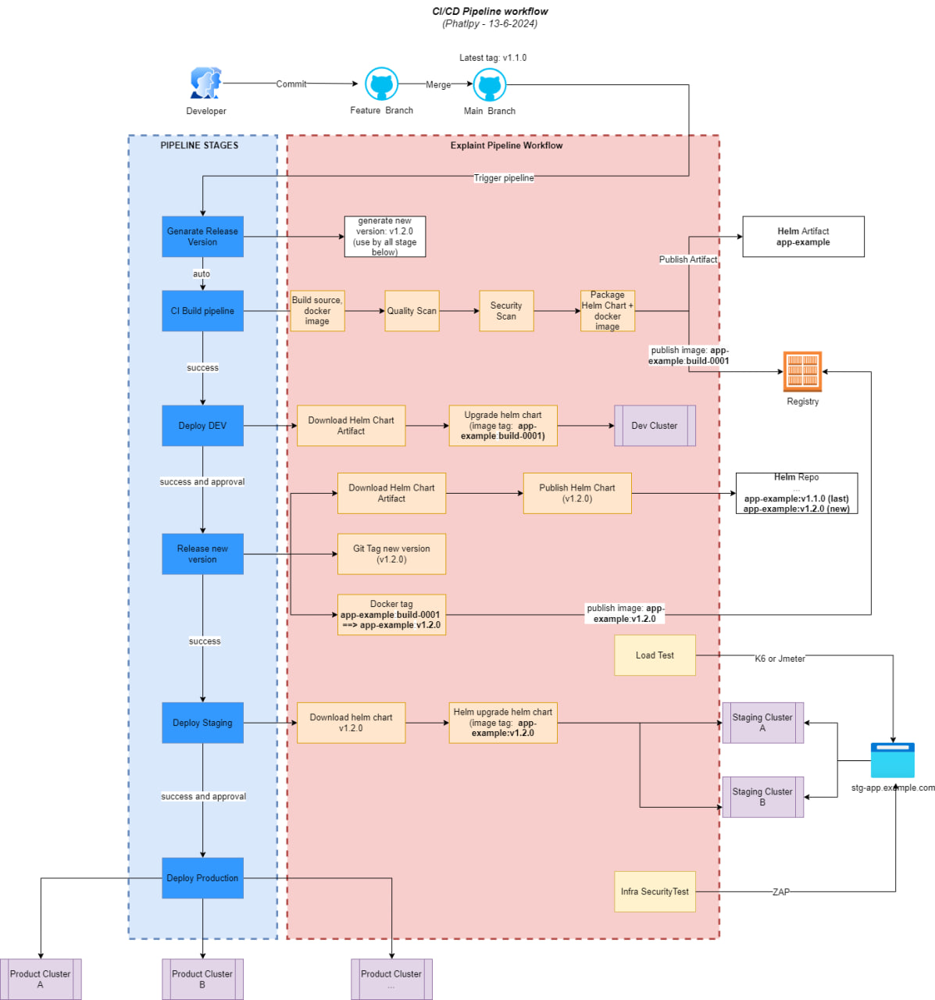
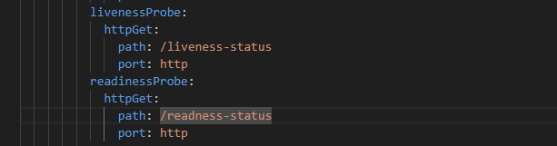
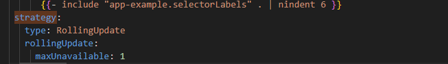

## Build a standard application deployment workflow
*** This example project is pipeline deployement workflow solution.
*** Pipeline syntax will not correctly(base on github acction and azdevops syntax). Recomment to use another CI tools (azureDevops or Jenkins)

### Requierment
- A good CICD pipeline was defined with clear stages
- Zero downtime deployment
- Notify status of pipeline to slack channel
- Common security vulnerabilities are identified and addressed before going to production
- Load testing was executed after going to staging environment
- Application is deployed onto multiple cluster in a single pipeline

### Diagram

### Resolve Requierment

#### 1. CICD pipeline was defined with clear stages

- Defined ci/cd pipeline template in repo [devops-templates](https://github.com/dos-example-project/devops-templates/tree/main) . Base on that , we can easier to setup and manage pipeline for all another applications in project.
- CI/CD pipeline included 4 parts:
    + Use git version tools like: GitVersion, semantic release,... to genarate new version of application that use for Release and deployment on Staging + Production
    + CI pipeline: When new commit is merged into main branch, this pipeline with trigger and do some tasks: unit test, build application, Scan Code issue, Scan Security issue, push artifact like: helm chart and docker image.
    + CD pipeline (Dev + Staging) include 5 stages: 
        * Deploy DEV: When `CI pipeline` is successful, this stage will be triggered and automatic deploy artifact from that into DEV environment.
        * Release: When DEV environment is tested and ready to release, need to approval from TTL to release new version for application. This stage can be versioning package,create tag, update changelog, ...
        * Deploy STG: After release stage, pipeline automate deploy versioned package from Release stage into STAGING environment. (STG env should apply mutil-cluster management, it's at least 2 clusters to clarify before application is promoted to production ) 
        * Loadtesting: After new version deployed to STG, This stage will trigger loadTest tools and publish report of the Test
        * Security Infra Test: This stage will use zap to run security automation test on STG throw STG URL.
    + CD pipeline (Prod): After everything is verified in STG environment. TTL can approve to deploy new version into PROD environment.

#### 2. Zero downtime deployment
- Requier: application need to include health-check endpoint
- Add livenessProbe and readnessProbe in [deployment template](https://github.com/dos-example-project/app-example/tree/main/helms/templates)

- Add rolling update Strategy in [deployment template](https://github.com/dos-example-project/app-example/tree/main/helms/templates)

#### 3. Notify status of pipeline to slack channel

- Added template to check pipeline status and use for each stage.
    [slack-notify.yaml](https://github.com/dos-example-project/devops-templates/blob/main/helpers/slack-notify.yaml)

#### 4. Common security vulnerabilities are identified and addressed before going to production

- Added Code And Docker image Security Scan step inside [ci-pipeline/backend-ci.yaml](https://github.com/dos-example-project/devops-templates/blob/main/ci-pipelines/backend-ci.yaml) with [helpers/security-scan.yaml](https://github.com/dos-example-project/devops-templates/blob/main/helpers/security-scan.yaml)
- Added Infra Security Scan step inside [cd-pipeline/dev-release-staging.yaml](https://github.com/dos-example-project/devops-templates/blob/main/cd-pipelines/dev-release-staging.yaml) (after STG deployment stage) with [helpers/zap-test.yaml](https://github.com/dos-example-project/devops-templates/blob/main/helpers/zap-test.yaml)

#### 5. Load testing was executed after going to staging environment

- Added LoadTest stage with tools like: K6, Jmeter,... (after STG deployment stage) inside [cd-pipeline/dev-release-staging.yaml](https://github.com/dos-example-project/devops-templates/blob/main/cd-pipelines/dev-release-staging.yaml) with [helpers/load-test.yaml](https://github.com/dos-example-project/devops-templates/blob/main/helpers/load-test.yaml)

#### 6. Application is deployed onto multiple cluster in a single pipeline

- This requierment is depend on multi-cluster engineer.
- Solution to deploy application to multiple cluster defined in [cd-pipelines/prod-deployment.yaml](https://github.com/dos-example-project/devops-templates/blob/main/cd-pipelines/prod-deployment.yaml)
- Summuary we will have 2 case: (base on my knowledge)
    + Centralized management(recommend):  We just need to deploy helmchart from management point. It'll automatic distribute application into all cluster base on business requierment. 
    + Decentralized management: We can define mutiple cluster configuration in somewhere and use loop funtion of pipeline tools to deploy application onto all cluster.
